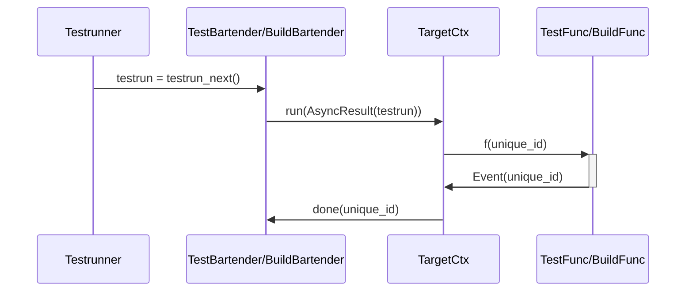

```mermaid
sequenceDiagram
    participant tr as Testrunner
    participant b as TestBartender/BuildBartender
    participant tx as TargetCtx
    participant f as TestFunc/BuildFunc
    tr->>b: testrun = testrun_next()
    b->>tx: run(AsyncResult(testrun))
    tx->>+f: f(unique_id)
    f->>-tx: Event(unique_id)
    tx->>b: done(unique_id)
```