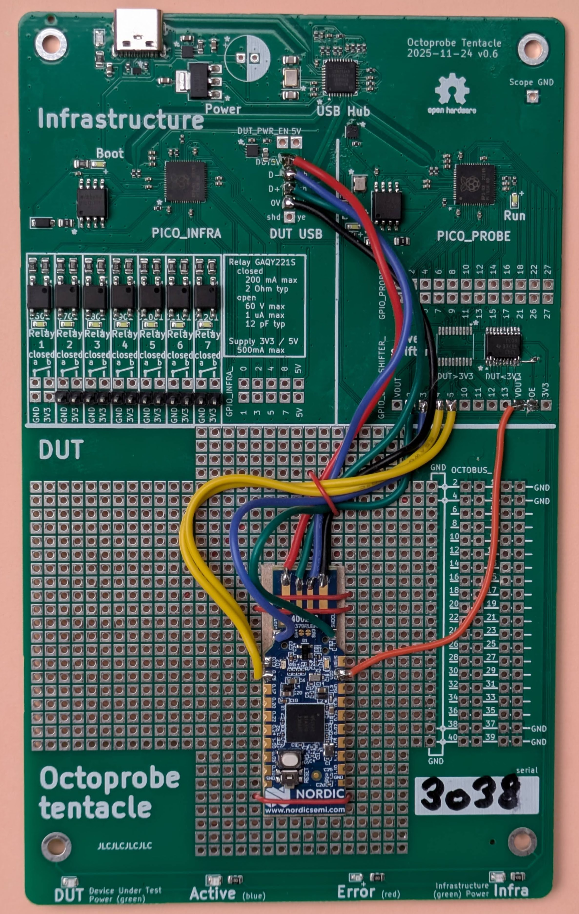

NRF52840_USB_DONGLE
=================================================

.. note:: 

    This tentacle currently may NOT run micropython tests as flashing is not implemented

    Tentacle spec: See `NRF52840_USB_DONGLE` in `src/testbed_micropython/tentacle_specs.py`

The goal of this tentacle is to verify if SWD and the levelshifter works ok.

Test SWD: A NRF52840 is programmed using the PICO_PROBE (with pico-probe-firmware) via level shifter on 1.7V.

There is a simplified version of the test where micropython is used to apply a square wave signal.

Flash DUT using PICO_PROBE
----------------------------------

Start picoprobe and DUT
^^^^^^^^^^^^^^^^^^^^^^^^^^^^^^^^^^^^

.. code-block:: bash

    op power --on proberun --on dut

Flash Erase

.. code-block:: bash

    openocd -f interface/cmsis-dap.cfg -f target/nordic/nrf52.cfg -c "gdb_flash_program enable" -c "init; nrf52_recover; exit;"

Flash Adafruit Bootloader
^^^^^^^^^^^^^^^^^^^^^^^^^^^^^^^^^^^^

.. code-block:: bash

    wget https://github.com/adafruit/Adafruit_nRF52_Bootloader/releases/download/0.9.2/pca10059_bootloader-0.9.2_s140_6.1.1.hex
    export IMAGE=pca10059_bootloader-0.9.2_s140_6.1.1.hex
    openocd -f interface/cmsis-dap.cfg -f target/nordic/nrf52.cfg -c "gdb_flash_program enable" -c "init; nrf52_recover; program "$IMAGE" verify reset exit"

Test the level shifter using micropython square wave signal
-------------------------------------------------------------

Program PICO_PROBE with pico-probe-firmware
^^^^^^^^^^^^^^^^^^^^^^^^^^^^^^^^^^^^^^^^^^^^^^^^^^^^^^^^^^^^^^^^^^^^^^^^

.. code-block:: bash

    op bootmode-probe

download uf2 from https://github.com/raspberrypi/debugprobe/releases 
place on drive RPI-RP2

.. code-block:: bash

    op bootmode-probe
    wget https://micropython.org/resources/firmware/RPI_PICO-20250911-v1.26.1.uf2

Apply the square wave signal
^^^^^^^^^^^^^^^^^^^^^^^^^^^^^^^^^^^^

.. code-block:: bash

    op power --on proberun --on dut

.. code-block:: python

    # micropython
    # CLK GPIO2
    # DIO GPI03

    from machine import Pin
    import time

    pinGPIO2 = Pin("GPIO2", Pin.OUT)
    pinGPIO3 = Pin("GPIO3", Pin.OUT)
    pinGPIO4 = Pin("GPIO4", Pin.OUT)
    pinGPIO5 = Pin("GPIO5", Pin.OUT)

    counter = 0
    while True:
        pinGPIO2.value(counter % 2 == 0)
        pinGPIO3.value(counter % 3 == 0)
        pinGPIO4.value(counter % 4 == 0)
        pinGPIO5.value(counter % 5 == 0)
        time.sleep(0.01)
        counter += 1
