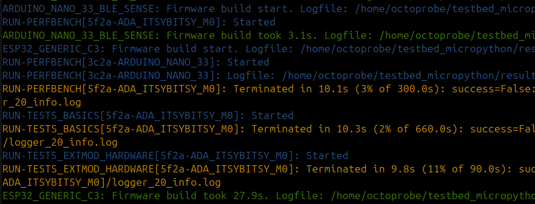

Test results
========================================

Log output
------------------------------------------------------------------------------------------

Colors:

* Blue: A firmware build or test has just started.
* Green: A firmware build or a test has successfully finished.
* Orange: A test has failed.
* Red: There was an error.

.. note:: 

    Lines starting with `ESP32_GENERIC_C3:`: You see where the firmware build starts (blue) end ends (green).

    Lines starting with `RUN-PERFBENCH[5f2a-ADA_ITSYBITSY_M0]:`: You see where the test starts (blue) and where it fails (orange).

python logging
------------------------------------------------------------------------------------------

We use python logging. There will always be written 3 files in parallel:

* logger_10_debug.log   # Contains logging.debug and above
* logger_20_info.log    # Contains logging.info and above
* logger_40_error.log   # Contains logging.error and above

You probably want to have a look at `logger_40_error.log` to know if an error happened. If yes, have a look at `logger_20_info.log` to see the error AND info messages. Etc.

Summary of test succeed / failed / skip / error
------------------------------------------------------------------------------------------

The is NO such summary yet.

Timing Report
------------------------------------------------------------------------------------------

The timing report is written in three formats: `task_report.md` / `.txt` / `.html`

* `Timing report` gives an overview of the time axis. All tentacles should be used all the time. The latest tentacle is the bottleneck.

  * Columns `mpbuild`, `A`, `B`, `C`: These are the lockable resource.
  * Task `a`, `b`, `c`: These are the firmwares which have been build by the FirmwareBartender process.
  * Task `2(b,c)`: This is Task `2` which is using two tentacles with the firmware `b` and `c`.

  This timing report is short and compact. The downside is, that you have too lookup the tantacles and tasks in the other tables.

* `Report input data`: This is the raw input data which was used to build the `Timing report`.

.. code:: 

    Timing report
    =============

    start  duration  mpbuild       A     B       C
    0.0s     +3.5s        a       .     .       .
    3.5s     +7.5s        b       .  1(a)       .
    11.0s     +1.0s        .  2(b,c)  1(a)  2(b,c)
    12.0s     +0.5s        .  2(b,c)     .  2(b,c)
    12.5s     +2.0s        c  2(b,c)  3(b)  2(b,c)
    14.5s     +0.5s        c  4(b,c)  3(b)  4(b,c)
    15.0s     +3.0s        c  4(b,c)     .  4(b,c)
    18.0s     +1.0s        c       .     .       .
    19.0s                  .       .     .       .

    Legend: Tentacles
    -----------------

    Tentacle-ID  Tentacles
        mpbuild  mpbuild  
            A  Lolin    
            B  PICO     
            C  PICO2    

    Legend: Tasks
    -------------

    Task-ID  Task               Tentacle                            Duration
        a  Build PICO2                                                3.5s
        b  Build PICO2-RISCV                                          7.5s
        c  Build ESP8266                                              6.5s
        1  Test X             PICO(PICO2)                             8.5s
        2  Test Test X        PICO2(PICO2-RISCV), Lolin(ESP8266)      3.5s
        3  Test Y             PICO(PICO2-RISCV)                       2.5s
        4  Test Test Y        PICO2(PICO2-RISCV), Lolin(ESP8266)      3.5s

    Report input data
    -----------------

    Start    End  Duration  Task               Tentacles                         
    0.0s   3.5s      3.5s  Build PICO2                                          
    3.5s  11.0s      7.5s  Build PICO2-RISCV                                    
    3.5s  12.0s      8.5s  Test X             PICO(PICO2)                       
    11.0s  14.5s      3.5s  Test Test X        PICO2(PICO2-RISCV), Lolin(ESP8266)
    12.5s  15.0s      2.5s  Test Y             PICO(PICO2-RISCV)                 
    12.5s  19.0s      6.5s  Build ESP8266                                        
    14.5s  18.0s      3.5s  Test Test Y        PICO2(PICO2-RISCV), Lolin(ESP8266)

`mpbuild` build results
------------------------------------------------------------------------------------------

There is a folder for every firmware variant.

`docker_stdout.txt` is the output of the `mpbuild` docker container and may be followed in real time (tail -f docker_stdout.txt).

.. code:: 

    ├── mpbuild
    │   ├── ESP32_GENERIC_S3
    │   │   ├── docker_stdout.txt
    │   │   ├── firmware.bin
    │   │   ├── firmware.spec
    │   │   ├── logger_10_debug.log
    │   │   ├── logger_20_info.log
    │   │   └── logger_40_error.log
    │   ├── RPI_PICO2
    │   │   ├── docker_stdout.txt
    │   │   ├── firmware.spec
    │   │   ├── firmware.uf2
    │   │   ├── logger_10_debug.log
    │   │   ├── logger_20_info.log
    │   │   └── logger_40_error.log
    │   ├── RPI_PICO2-RISCV
    │   │   ├── docker_stdout.txt
    │   │   ├── firmware.spec
    │   │   ├── firmware.uf2
    │   │   ├── logger_10_debug.log
    │   │   ├── logger_20_info.log
    │   │   └── logger_40_error.log

`RUN-xxx` test results
------------------------------------------------------------------------------------------

There is a folder for every firmware variant.

The `testid` is:

* `RUN-MULTITESTS_MULTIBLUETOOTH`: The name of the test.
* `1830-LOLIN_C3_MINI`: The first associated tentacle. `1830` is the tentacle serial number.
* `3c2a-ARDUINO_NANO_33`: The second associated tentacle. `3c2a` is the tentacle serial number.

`testresults.txt` is the output of the testprogram and may be followed in real time (tail -f testresults.txt).

.. code:: 

    ├── RUN-MULTITESTS_MULTIBLUETOOTH[1830-LOLIN_C3_MINI,3c2a-ARDUINO_NANO_33]
    │   ├── logger_10_debug.log
    │   ├── logger_20_info.log
    │   ├── logger_40_error.log
    │   └── testresults.txt
    ├── RUN-MULTITESTS_MULTIBLUETOOTH[1830-LOLIN_C3_MINI,552b-RPI_PICO2_W]
    │   ├── logger_10_debug.log
    │   ├── logger_20_info.log
    │   ├── logger_40_error.log
    │   └── testresults.txt
    ├── RUN-PERFBENCH[2731-RPI_PICO2-RISCV]
    │   ├── flashing_stout.txt
    │   ├── logger_10_debug.log
    │   ├── logger_20_info.log
    │   ├── logger_40_error.log
    │   └── testresults.txt
    ├── RUN-PERFBENCH[2731-RPI_PICO2]
    │   ├── flashing_stout.txt
    │   ├── logger_10_debug.log
    │   ├── logger_20_info.log
    │   ├── logger_40_error.log
    │   └── testresults.txt
